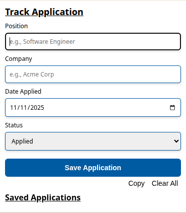

A simple extension to track job applications (no login needed). 
Enter the position, company, date applied and the status of the application and it will save the application in the following format:
position - company - dd/mm/yyyy - status.
You then have the option to export them as a list copied to the clipboard.

